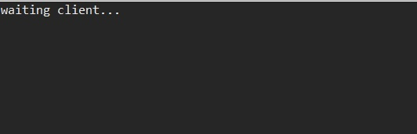
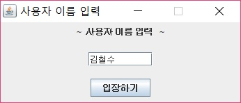
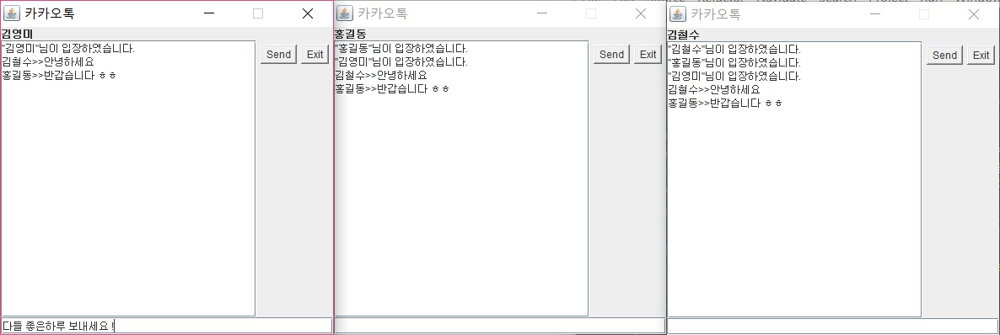
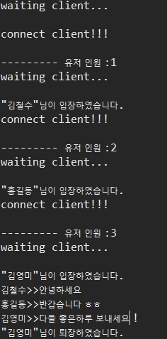

멀티스레드를 활용한 채팅 서버/클라이언트 프로그램
========================================

프로그램 설명
------------------
 이 프로그램은 자바로 구현한 채팅 서버/클라이언트 프로그램입니다. 멀티스레드를 활용하여 클라이언트들 간 채팅이 가능한 프로그램입니다.
 
 1. 멀티스레드 활용
  클라이언트가 접속할 때 마다 서버는 스레드를 만들어 클라이언트와 통신할 수 있도록 하였다.
  
 2. 소켓 통신 활용
  클라이언트는 socket 메서드를 통해 서버의 ip주소로 소켓 통신을 시도한다.
  
 3. ObjectStream 활용
  sokcet의 입출력은 Object형태로 Input/Output stream으로 데이터를 주고받는다.

실행 화면
------------

서버 측 화면 > 클라이언트 접속 대기 화면
  

클라이언트 측 화면 > 로그인 화면
  

다중 클라이언트 실행화면
  

  

보완할 점
----------
보완할 점은 다음과 같다...

>123
>>12313

1. 123
2. 123
3. 12323

